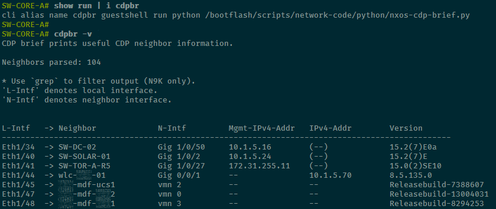

# Misc Code

Miscellaneous code primarily used in my role as a network engineer.

# Python Scripts

## `nxos-cdp-brief.py`

I wanted a way to print a CDP brief on NXOS switches to list each neighbor's local interface, neighbor interface, hostname, and IP addresses (mgmt or otherwise). `nxos-cdp-brief.py` is a script to run *on* an NX-OS device to print a custom CDP neighbor brief table. 
One line is printed per CDP neighbor, containing the following information; 
**Local interface**, **Neighbor hostname**, **interface**, **IP address** (mgmt preferred), **platform**, and **version***.

_*Use the args `-p` or `-v` to print the CDP table **with** platform or version information, respectively. There may be some regex parsing issues, has only been validated against most Cisco equipment and some ESXi builds._

### Usage

1. Enable guestshell on the NX-OS device (optional).
2. Install the natsort python module via guestshell (optional);
   - `sudo chvrf management pip install natsort`
3. Copy this script to bootflash:/scripts/nxos-cdp-brief.py
4. Create a command alias on NX-OS CLI;
   - With guestshell: `cli alias name cdpbr guestshell run python /bootflash/scripts/nxos-cdp-brief.py`
   - Without guestshell: `cli alias name cdpbr python /bootflash/scripts/nxos-cdp-brief.py`
5. Type `cdpbr` in NX-OS CLI to output a useful CDP brief table.